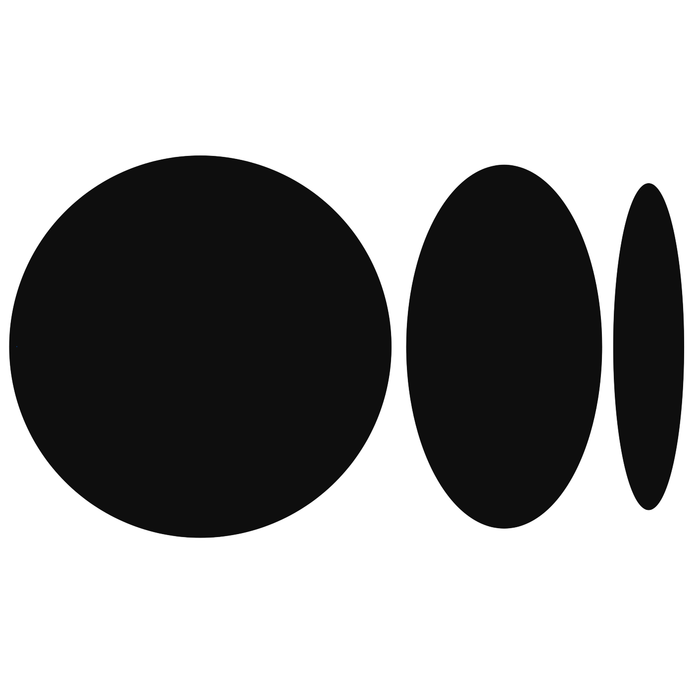

# Hi there 👋
 

 

## ✨ Here is a bit about me ✨

- 🧑🏽‍💻 I work as a *Developer / Research Assistant at Monash University* 🪃
- 📖 I am studying a double degree of **Computer Science and Econometrics** at Monash University.
- 🔭 Recently I have been reading about history, economics, Tech, travelling and etc.
- 👯 I’m happy to collaborate on any crazy idea you might have!
- 🤔 I'm planning to become a Machine Learning engineer.
- 💬 We can have a chat about Computer science, philosophy, statistics, Startups, Persian history & culture, economics and etc. 
- 📫 How to reach me: Linkedin, Twitter and medium blogs are linked at the top of this page!
- ⚡ Fun fact: **I watch random lectures in my spare time!**
